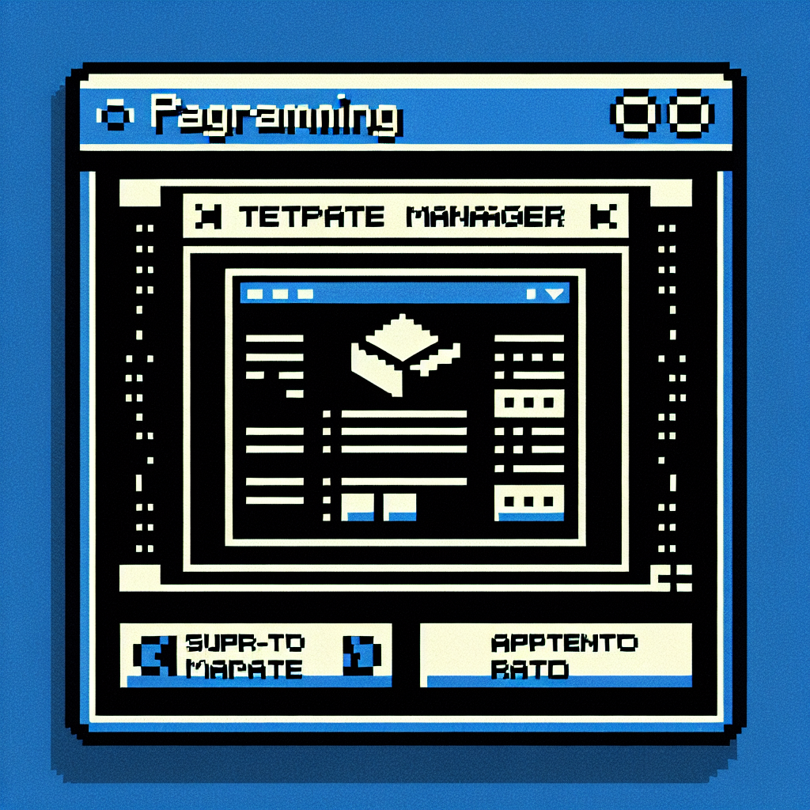

# Template Manager CLI

<div align="center">
  
</div>

## Introduction

Template Manager is a command-line tool that helps you manage templates for your projects. It allows you to add, list, and remove templates from your template repository.

## Why Template Manager?

Feel tired of managing templates in different places? 😩📂

Template Manager can help you manage templates in a single git repository, and you can manage all your templates in a single place.

## Features

- 🌍 Support multiple remote sources for flexible template management.
- 📂 Manage templates in a single git repository.
- 📂 Easy to add, list, remove, update templates.
- 🌐 Open templates in the browser quickly.
- 🚀 Create new projects from templates with a single command.
- 🔄 Pull templates from the remote repository to your local.

## Installation

### Install the template manager
```bash
npm install -g template-manager-cli
```

### Setting Up Your Template Repository

When using Template Manager for the first time, you'll need to set up a remote template source. This is typically a GitHub repository URL.

1. Add a remote template source:
```bash
# tm remote add <name> <source-url>
tm remote add my-template-repo git@github.com:Donovan-Ye/template-manager.git
```

2. List your remote template sources:
```bash
tm remote list
```

3. Select a remote template source as your current source:
```bash
# tm remote use <name>
tm remote use my-template-repo
```

4. Initialize your template repository:
```bash
tm init
```

This command sets up your repository with the necessary files: `template.json` and `README.md`. If these files already exist, you'll be prompted to overwrite them.

For more details on the `tm remote` command, use `tm remote -h`.

#### Manual Setup (Optional)

If you prefer not to use the `tm init` command, ensure you have the following files in your repository:

1. `template.json`:
   ```json
   [
     {
       "name": "template-name",
       "path": "template-path"
     }
   ]
   ```

2. `README.md` with placeholders `<!-- tm-list-start -->` and `<!-- tm-list-end -->` for the template list:
   ```md
   # My Templates Repository

   ## My templates
   <!-- tm-list-start -->

   <!-- tm-list-end -->
   ```

### Managing Your Templates

Once your repository is set up, you can start managing your templates:

- Add a new template:
```bash
# tm add <template-name> <template-path>
tm add template-name template-path
```

- List all templates:
```bash
tm list
```

- Update an existing template:
```bash
# tm set <template-name> <template-path>
tm set template-name new-template-path
```

- Pull a template from the remote repository:
```bash
# tm pull [template-name]
tm pull template-name
# or don't specify the template name, it will pull all templates from the remote repository
tm pull
```

- Create a new project from a template, it will clone the template to your local and remove the git history:
```bash
# tm create [template-name]
tm create template-name
# or don't specify the template name, it will prompt you to choose one from the template list
tm create
```

- Open a template in the browser:
```bash
# tm open [template-name]
tm open template-name
# or don't specify the template name, it will prompt you to choose one from the template list
tm open
```

- Remove a template:
```bash
# tm remove [template-name]
tm remove template-name
# or don't specify the template name, it will remove all templates
tm remove
```

For a complete list of commands and their usage, run `tm -h`.

## Usage

### Global Options
```bash
Usage: tm [options] [command]

A CLI tool to manage your project templates.

Options:
  -v, --version          display the version number
  -h, --help             display help for command

Commands:
  remote                 Manage remote template sources
  init [options]         Initialize current remote source repository with initial files.
  add <template> <path>  Add a new template.
  list|ls [options]      List all available templates from your template repository, will be cached for 1 hour. You can use -f to force to get
                         templates from the template repository.
  set <template> <path>  Update a template to a path.
  remove|rm [template]   Remove a template.
  open                   Choose a template to open in the browser.
  create                 Choose a template to create a new project, all the git history will be removed.
  pull                   Pull a template from the remote repository, all the git history will be preserved.
  help [command]         display help for command
```

### Remote Commands
```bash
Usage: tm remote [options] [command]

Manage remote template sources

Options:
  -h, --help               display help for command

Commands:
  list|ls                  List all remote template sources
  add <name> <source-url>  Add a remote template source
  remove|rm <name>         Remove a remote template source
  use <name>               Use a remote template source
  help [command]           display help for command
```

## License

[MIT](./LICENSE) License © 2024-PRESENT [DonovanYe](https://github.com/Donovan-Ye)
